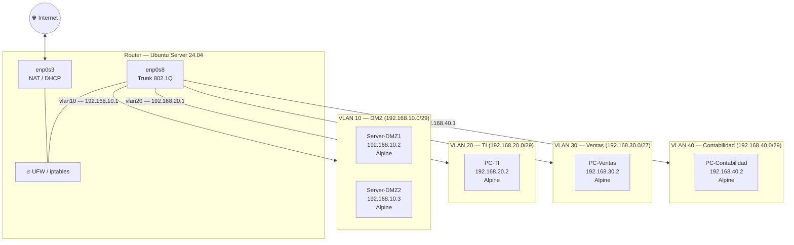

# Laboratorio 3.2: Infraestructura de Red Empresarial con VLANs
### Informe Educativo/Reflexivo — Jerarquía de Red y Resolución de Problemas

**Universidad San Francisco Xavier de Chuquisaca**  
**Asignatura:** Infraestructura, Plataformas Tecnológicas y Redes (SIS313)  
**Docente:** Ing. Marcelo Quispe Ortega  
**Semestre:** 1/2026  

**Integrantes:**
- Luis Fernando Quispe Sullca
- Calatayud Mamani Alex Josue

---

## 1. Introducción: ¿Por qué VLANs en una organización?

Antes de describir los pasos técnicos, vale la pena preguntarse: **¿qué problema resuelven las VLANs?**

En una red empresarial sin segmentación, todos los dispositivos comparten el mismo dominio de broadcast. Esto significa que cualquier equipo puede, potencialmente, "escuchar" o intentar comunicarse con cualquier otro. Desde una perspectiva de seguridad, esto es indeseable: ¿debería un servidor de la DMZ poder enviar paquetes directamente hacia la red de Contabilidad donde se manejan datos financieros?

Las VLANs (Virtual Local Area Networks) resuelven esto dividiendo lógicamente una red física en múltiples redes aisladas, cada una con sus propias políticas de comunicación. En este laboratorio, implementamos exactamente ese escenario con cuatro VLANs que representan departamentos reales de una organización.

---

## 2. Topología del Escenario



### Tabla de Equipos y Roles

| VM | SO | VLAN | Rol en la organización | IP |
|---|---|---|---|---|
| Router | Ubuntu Server 24.04 | Trunk | Enrutamiento, firewall, NAT | Múltiples |
| Server-DMZ1 | Alpine Linux | 10 | Servidor expuesto a internet | 192.168.10.2 |
| Server-DMZ2 | Alpine Linux | 10 | Servidor expuesto a internet | 192.168.10.3 |
| PC-TI | Alpine Linux | 20 | Administración de sistemas | 192.168.20.2 |
| PC-Ventas | Alpine Linux | 30 | Área comercial | 192.168.30.2 |
| PC-Contabilidad | Alpine Linux | 40 | Área financiera | 192.168.40.2 |

---

## 3. Paso a Paso: Configuración del Router (Ubuntu Server)

### 3.1 Exploración inicial del sistema

```bash
ip a
```

**¿Qué aprendemos aquí?** El comando `ip addr` (o su forma corta `ip a`) nos muestra el estado actual del sistema de red. Es el equivalente a "abrir los ojos" antes de comenzar a trabajar. Ver cuántas interfaces existen, si están activas (`UP`) o inactivas (`DOWN`), y qué IPs tienen asignadas nos ayuda a entender el punto de partida y evitar conflictos futuros.


---

### 3.2 Preparación del entorno: actualización e instalación

```bash
sudo apt update
sudo apt install vlan -y
```

**Reflexión:** En administración de sistemas, el orden importa. Actualizar primero (`apt update`) garantiza que obtenemos la versión más reciente y segura del paquete `vlan`, evitando instalar software desactualizado con vulnerabilidades conocidas. El paquete `vlan` instala las herramientas necesarias para que el sistema operativo pueda crear y gestionar sub-interfaces 802.1Q.

> **Nota para el estudiante:** `sudo` (Super User DO) ejecuta el comando con privilegios elevados. Muchas operaciones de red requieren permisos de root porque modifican configuraciones que afectan a todos los usuarios del sistema.

---

### 3.3 Activar el soporte de VLANs en el kernel

```bash
sudo modprobe 8021q
```

**¿Qué es un módulo del kernel?** El kernel de Linux es el núcleo del sistema operativo. Para mantener un tamaño reducido en memoria, muchas funcionalidades se cargan como módulos opcionales. El módulo `8021q` implementa el protocolo IEEE 802.1Q que es el estándar internacional para el etiquetado de tramas Ethernet con identificadores de VLAN. Sin este módulo, el kernel literalmente no sabe qué hacer cuando recibe una trama etiquetada.

> **Concepto clave:** IEEE 802.1Q añade una cabecera de 4 bytes al frame Ethernet que incluye el VLAN ID (12 bits, soporte para hasta 4094 VLANs distintas).

---

### 3.4 Configuración declarativa de la red con Netplan

```bash
sudo nano /etc/netplan/50-cloud-init.yaml
```

```yaml
network:
  version: 2
  ethernets:
    enp0s3:
      dhcp4: true
    enp0s8:
      dhcp4: no
      optional: true
  vlans:
    vlan10:
      link: enp0s8
      id: 10
      addresses:
        - 192.168.10.1/29
      nameservers:
        addresses: [8.8.8.8]
    vlan20:
      link: enp0s8
      id: 20
      addresses:
        - 192.168.20.1/29
      nameservers:
        addresses: [8.8.8.8]
    vlan30:
      link: enp0s8
      id: 30
      addresses:
        - 192.168.30.1/27
      nameservers:
        addresses: [8.8.8.8]
    vlan40:
      link: enp0s8
      id: 40
      addresses:
        - 192.168.40.1/29
      nameservers:
        addresses: [8.8.8.8]
```

**Entendiendo la lógica de este archivo:**

La interfaz `enp0s8` actúa como **puerto trunk**: no tiene IP propia, pero es la "autopista" por la que circulan los frames etiquetados de todas las VLANs. Cada bloque `vlan10`, `vlan20`, etc. define una sub-interfaz virtual que "sube" sobre ese trunk.

Cada sub-interfaz tiene asignada la IP que será el **gateway (puerta de enlace)** de los clientes en esa VLAN. Es decir, cuando un cliente en VLAN 20 quiere salir de su red, envía el paquete a `192.168.20.1`, que es la IP de `vlan20` en el router.

> **Concepto clave — Router-on-a-Stick:** Esta arquitectura donde un único router con una sola interfaz física gestiona múltiples VLANs se llama "Router-on-a-Stick". Es eficiente en entornos virtualizados como este, donde el switch también es virtual.

```bash
sudo netplan apply
```


---

### 3.5 Habilitar el reenvío de paquetes (IP Forwarding)

```bash
sudo nano /etc/sysctl.conf
# Descomentar o agregar:
net.ipv4.ip_forward=1

sudo sysctl -p
```

**¿Por qué esto es necesario?** Por defecto, Linux actúa como un **host**: procesa solo los paquetes destinados a su propia IP y descarta el resto. Para que funcione como **router**, necesitamos decirle explícitamente que reenvíe los paquetes que lleguen de una interfaz hacia otra. El parámetro `ip_forward=1` cambia este comportamiento fundamental. Sin él, ninguna comunicación inter-VLAN funcionaría, aunque las reglas UFW estén perfectamente configuradas.

---

## 4. Configuración del Firewall UFW — Entendiendo las Políticas

### 4.1 ¿Qué es UFW y cómo funciona?

UFW (Uncomplicated Firewall) es una capa de abstracción sobre `iptables`, el sistema de filtrado de paquetes del kernel Linux. Cuando ejecutamos reglas `ufw route`, estamos definiendo qué tráfico puede **atravesar** el router (cadena FORWARD de iptables), no qué tráfico puede entrar o salir del propio router.

### 4.2 Reglas de acceso entre VLANs

```bash
# TI tiene acceso a todo (VLAN 20 → 10, 30, 40)
sudo ufw route allow in on vlan20 out on vlan10
sudo ufw route allow in on vlan20 out on vlan30
sudo ufw route allow in on vlan20 out on vlan40

# Ventas solo accede a DMZ (VLAN 30 → 10)
sudo ufw route allow in on vlan30 out on vlan10

# Contabilidad accede a DMZ y Ventas (VLAN 40 → 10, 30)
sudo ufw route allow in on vlan40 out on vlan10
sudo ufw route allow in on vlan40 out on vlan30

# DMZ no puede acceder a ningún departamento interno
sudo ufw route deny in on vlan10 out on vlan20
sudo ufw route deny in on vlan10 out on vlan30
sudo ufw route deny in on vlan10 out on vlan40

# Ventas no puede acceder a TI ni Contabilidad
sudo ufw route deny in on vlan30 out on vlan20
sudo ufw route deny in on vlan30 out on vlan40

# Contabilidad no puede acceder a TI
sudo ufw route deny in on vlan40 out on vlan20
```

**Reflexión sobre las políticas de negocio reflejadas en la red:**

Estas reglas no son arbitrarias; representan decisiones organizacionales reales:

- **TI accede a todo** porque el departamento de tecnología necesita gestionar todos los sistemas.
- **La DMZ está aislada** porque sus servidores son los más expuestos a amenazas externas; si un servidor es comprometido, no debe poder "pivotar" hacia redes internas.
- **Ventas no accede a Contabilidad** porque la información financiera es confidencial.
- **Contabilidad accede a Ventas** posiblemente para consultar datos de facturación, pero no puede acceder a TI porque no tiene necesidad de administrar sistemas.

> **Lección clave:** Las políticas de firewall deben reflejar los flujos de trabajo reales de la organización. Un buen administrador de redes entiende el negocio, no solo la tecnología.


---

### 4.3 NAT — Compartir una IP pública con múltiples redes

```bash
sudo nano /etc/ufw/before.rules
```

Agregar al inicio:

```
*nat
:POSTROUTING ACCEPT [0:0]
-A POSTROUTING -s 192.168.20.0/29 -o enp0s3 -j MASQUERADE
-A POSTROUTING -s 192.168.40.0/29 -o enp0s3 -j MASQUERADE
COMMIT
```

```bash
sudo ufw reload
```

**¿Qué está pasando aquí?**

La regla `MASQUERADE` implementa NAT (Network Address Translation). Cuando un host de TI (`192.168.20.2`) quiere acceder a Google, el paquete tiene como IP de origen `192.168.20.2`. Sin NAT, Internet no sabe cómo responder a esa IP privada.

Con `MASQUERADE`, el router **sustituye** la IP de origen por su propia IP pública (la obtenida por DHCP en `enp0s3`) antes de enviarlo a Internet, y mantiene una tabla de traducciones para saber a qué máquina interna entregar la respuesta.

> **¿Por qué solo TI y Contabilidad?** Las subredes de DMZ y Ventas no tienen reglas NAT, por lo tanto sus paquetes llegan a `enp0s3` con IP de origen privada y son descartados por Internet, que no sabe cómo responder. Esta es una forma deliberada de controlar el acceso a internet.


### 4.4 Bloqueo de ICMP Forward

```bash
# En /etc/ufw/before.rules, comentar:
#-A ufw-before-forward -p icmp --icmp-type echo-request -j ACCEPT

sudo ufw reload
```

**¿Por qué bloquear el ping?** ICMP echo-request es el protocolo que usa el comando `ping`. Al deshabilitar su reenvío entre VLANs, evitamos que los departamentos puedan hacer reconocimiento de la red de otros. Un atacante que comprometa un equipo de Ventas no podrá usar `ping` para descubrir qué equipos están activos en la red de TI.

---

## 5. Configuración de Clientes Alpine Linux

Alpine Linux es una distribución minimalista pensada para entornos de servidor y contenedores. A diferencia de Ubuntu, no usa `systemd` ni `netplan`, sino el archivo clásico `/etc/network/interfaces`.

### 5.1 PC-Contabilidad (VLAN 40)

```bash
apk add vlan
nano /etc/network/interfaces
```

```
auto lo
iface lo inet loopback

auto eth0.40
iface eth0.40 inet static
    address 192.168.40.2
    netmask 255.255.255.248
    gateway 192.168.40.1
    vlan-id 40

auto eth0
iface eth0 inet manual
    up ip link set $IFACE up
    down ip link set $IFACE down
```

```bash
service networking restart
```

### 5.2 PC-Ventas (VLAN 30)

```bash
apk add vlan
nano /etc/network/interfaces
```

```
auto lo
iface lo inet loopback

auto eth0.30
iface eth0.30 inet static
    address 192.168.30.2
    netmask 255.255.255.224
    gateway 192.168.30.1
    vlan-id 30

auto eth0
iface eth0 inet manual
    up ip link set $IFACE up
    down ip link set $IFACE down
```

```bash
service networking restart
```

### 5.3 PC-TI (VLAN 20)

```bash
apk add vlan
nano /etc/network/interfaces
```

```
auto lo
iface lo inet loopback

auto eth0.20
iface eth0.20 inet static
    address 192.168.20.2
    netmask 255.255.255.248
    gateway 192.168.20.1
    vlan-id 20

auto eth0
iface eth0 inet manual
    up ip link set $IFACE up
    down ip link set $IFACE down
```

```bash
service networking restart
```

### 5.4 Servers DMZ (VLAN 10)

**Server-DMZ1:**

```
auto eth0.10
iface eth0.10 inet static
    address 192.168.10.2
    netmask 255.255.255.248
    gateway 192.168.10.1
    vlan-id 10
```

**Server-DMZ2:**

```
auto eth0.10
iface eth0.10 inet static
    address 192.168.10.3
    netmask 255.255.255.248
    gateway 192.168.10.1
    vlan-id 10
```

**Entendiendo la notación `eth0.40`:** En Linux, la convención para nombrar sub-interfaces VLAN es `<interfaz_padre>.<vlan_id>`. Así, `eth0.40` indica: "la sub-interfaz sobre `eth0` que lleva el tag VLAN 40". El sistema operativo crea esta interfaz virtual automáticamente cuando el paquete `vlan` está instalado y la directiva `vlan-id` está presente en la configuración.


---

## 6. Verificación y Resolución de Problemas

### 6.1 Lista de verificación de pruebas

| Prueba | Desde | Hacia | Resultado esperado |
|---|---|---|---|
| Ping al gateway | PC-Contabilidad | 192.168.40.1 | ✅ Exitoso |
| Ping a internet | PC-Contabilidad | google.com | ✅ Exitoso (tiene NAT) |
| Ping a internet | PC-Ventas | google.com | ❌ Falla (sin NAT) |
| SSH | PC-Ventas | 192.168.40.2 | ❌ Denegado (regla UFW) |
| SSH | PC-TI | 192.168.10.2 | ✅ Exitoso (TI accede a todo) |
| SSH | PC-Contabilidad | 192.168.30.2 | ✅ Exitoso (Contab → Ventas permitido) |
| Ping | Server-DMZ1 | 192.168.20.2 | ❌ Denegado (DMZ aislada) |


### 6.2 Problemas comunes y cómo resolverlos

#### Problema 1: La sub-interfaz VLAN no aparece después de `netplan apply`

**Síntoma:** `ip a` no muestra `vlan10`, `vlan20`, etc.  
**Posible causa:** El módulo `8021q` no está cargado.  
**Solución:**
```bash
sudo modprobe 8021q
sudo netplan apply
```

#### Problema 2: El cliente Alpine no puede llegar al gateway de su VLAN

**Síntoma:** `ping 192.168.40.1` desde PC-Contabilidad falla.  
**Posible causa 1:** La sub-interfaz no se levantó correctamente.  
**Diagnóstico:**
```bash
ip addr show eth0.40
```
Si no aparece, ejecutar:
```bash
service networking restart
```

**Posible causa 2:** El VLAN ID en Alpine no coincide con el configurado en el router.  
**Verificar:** `vlan-id 40` en Alpine debe coincidir con `id: 40` en el YAML de Netplan.

#### Problema 3: TI no tiene acceso a internet a pesar de tener regla NAT

**Síntoma:** `ping google.com` falla desde PC-TI.  
**Posible causa:** El IP forwarding no está habilitado.  
**Diagnóstico:**
```bash
cat /proc/sys/net/ipv4/ip_forward
```
Si muestra `0`, ejecutar:
```bash
sudo sysctl -w net.ipv4.ip_forward=1
```
Y verificar que `net.ipv4.ip_forward=1` esté en `/etc/sysctl.conf` para persistencia.

#### Problema 4: Las reglas UFW no tienen efecto sobre el tráfico inter-VLAN

**Síntoma:** Tráfico que debería estar denegado pasa de todas formas.  
**Posible causa:** UFW no está habilitado.  
**Diagnóstico y solución:**
```bash
sudo ufw status
# Si muestra "inactive":
sudo ufw enable
```

---

## 7. Conceptos Clave Aprendidos

### Jerarquía de la red en este laboratorio

```
Modelo OSI         Elemento del Lab
─────────────────────────────────
Capa 3 (Red)   →  Router Ubuntu + Netplan + UFW + iptables
Capa 2 (Enlace)→  802.1Q VLAN tagging (módulo 8021q)
Capa 1 (Física)→  Interfaces virtuales VirtualBox (Red Interna)
```

### Principios de seguridad aplicados

1. **Principio de menor privilegio:** Cada VLAN tiene exactamente el nivel de acceso que necesita para operar, y nada más.
2. **Defensa en profundidad:** La DMZ está aislada por múltiples capas: no tiene NAT, tiene reglas DENY en UFW, y el ICMP forward está deshabilitado.
3. **Segmentación de red:** Aunque todos los equipos comparten el mismo hardware de red virtual, su tráfico está lógicamente separado y controlado.

---

## 8. Conclusiones — Enfoque en Aprendizaje

1. **La jerarquía de red no es solo técnica, es organizacional:** Cada regla de firewall que implementamos en este laboratorio tiene una razón de negocio detrás. El aprendizaje más valioso no es dominar la sintaxis de UFW, sino comprender por qué TI necesita acceder a todo y por qué la DMZ debe estar aislada.

2. **Linux como plataforma de red es poderoso y transparente:** Usar Ubuntu Server como router demostró que cualquier sistema Linux puede cumplir este rol con herramientas nativas del sistema operativo (módulos del kernel, netplan, iptables/ufw). Esto refuerza la comprensión de cómo funciona la red a bajo nivel, a diferencia de los routers de caja negra.

3. **Alpine Linux enseña sobre la esencia de la configuración de red:** Al no tener herramientas de abstracción como NetworkManager o netplan, Alpine obliga al estudiante a trabajar directamente con `/etc/network/interfaces`, reforzando el conocimiento de parámetros fundamentales como gateway, netmask y VLAN ID.

4. **El debugging de red requiere un método:** Los problemas de conectividad se diagnostican capa por capa: primero verificar que la interfaz existe, luego que tiene la IP correcta, luego que el gateway responde, y finalmente que las reglas de firewall permiten el tráfico. Este enfoque sistemático es transferible a cualquier entorno de red.

5. **La virtualización es un laboratorio infinito:** VirtualBox permitió simular una infraestructura empresarial completa en un solo equipo físico. Esta capacidad de reproducir entornos complejos en un ambiente controlado es fundamental para el aprendizaje y para las pruebas previas a despliegues en producción.

---

*Informe generado para el Laboratorio 3.2 — SIS313 — Universidad San Francisco Xavier de Chuquisaca*
