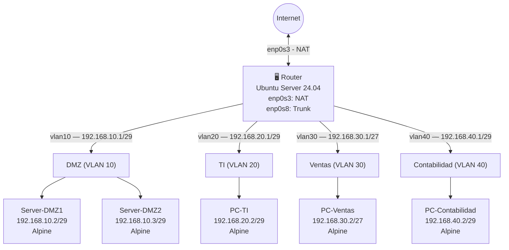

# Laboratorio 3.2: Infraestructura de Red Empresarial con VLANs
### Informe Técnico — Enfoque en Eficiencia de Configuración

**Universidad San Francisco Xavier de Chuquisaca**  
**Asignatura:** Infraestructura, Plataformas Tecnológicas y Redes (SIS313)  
**Docente:** Ing. Marcelo Quispe Ortega  
**Semestre:** 1/2026  

**Integrantes:**
- Luis Fernando Quispe Sullca
- Calatayud Mamani Alex Josue

---

## 1. Topología de Red



### Tabla de Direccionamiento

| VM | Departamento | VLAN | Subred | IP | Máscara |
|---|---|---|---|---|---|
| Router | — | Trunk | — | Múltiples gateways | — |
| Server-DMZ1 | DMZ | 10 | 192.168.10.0/29 | 192.168.10.2 | /29 |
| Server-DMZ2 | DMZ | 10 | 192.168.10.0/29 | 192.168.10.3 | /29 |
| PC-TI | TI | 20 | 192.168.20.0/29 | 192.168.20.2 | /29 |
| PC-Ventas | Ventas | 30 | 192.168.30.0/27 | 192.168.30.2 | /27 |
| PC-Contabilidad | Contabilidad | 40 | 192.168.40.0/29 | 192.168.40.2 | /29 |

### Matriz de Políticas de Acceso

| Origen \ Destino | DMZ (10) | TI (20) | Ventas (30) | Contabilidad (40) | Internet |
|---|---|---|---|---|---|
| **DMZ (10)** | — | ❌ | ❌ | ❌ | ❌ |
| **TI (20)** | ✅ | — | ✅ | ✅ | ✅ |
| **Ventas (30)** | ✅ | ❌ | — | ❌ | ❌ |
| **Contabilidad (40)** | ✅ | ❌ | ✅ | — | ✅ |

---

## 2. Configuración del Router (Ubuntu Server)

### 2.1 Verificación del Estado Inicial de Interfaces

```bash
ip a
```

**Explicación:** `ip a` (abreviación de `ip addr show`) lista todas las interfaces de red del sistema con sus direcciones IP, máscaras, estado (UP/DOWN) y flags. Es el punto de partida para auditar el estado actual antes de cualquier cambio.


---

### 2.2 Actualización del Sistema e Instalación de Herramientas VLAN

```bash
sudo apt update
sudo apt install vlan -y
```

| Componente | Descripción |
|---|---|
| `sudo` | Ejecuta el comando con privilegios de superusuario (root). |
| `apt update` | Sincroniza los índices de paquetes locales con los repositorios remotos. |
| `apt install vlan` | Instala el paquete `vlan` que provee las utilidades `vconfig` e `ip link` para gestionar interfaces 802.1Q. |
| `-y` | Responde "sí" automáticamente a las confirmaciones de instalación, permitiendo ejecución no interactiva. |

---

### 2.3 Carga del Módulo del Kernel 802.1Q

```bash
sudo modprobe 8021q
```

**Explicación:** `modprobe` carga módulos del kernel de Linux en tiempo de ejecución. El módulo `8021q` implementa el estándar IEEE 802.1Q (etiquetado de VLANs). Sin este módulo activo, el kernel no puede crear sub-interfaces VLAN ni procesar tramas etiquetadas.

> **Optimización:** Para que el módulo persista entre reinicios, agregar `8021q` al archivo `/etc/modules`.

---

### 2.4 Configuración de Interfaces VLAN con Netplan

```bash
sudo nano /etc/netplan/50-cloud-init.yaml
```

Contenido del archivo:

```yaml
network:
  version: 2
  ethernets:
    enp0s3:
      dhcp4: true
    enp0s8:
      dhcp4: no
      optional: true
  vlans:
    vlan10:
      link: enp0s8
      id: 10
      addresses:
        - 192.168.10.1/29
      nameservers:
        addresses: [8.8.8.8]
    vlan20:
      link: enp0s8
      id: 20
      addresses:
        - 192.168.20.1/29
      nameservers:
        addresses: [8.8.8.8]
    vlan30:
      link: enp0s8
      id: 30
      addresses:
        - 192.168.30.1/27
      nameservers:
        addresses: [8.8.8.8]
    vlan40:
      link: enp0s8
      id: 40
      addresses:
        - 192.168.40.1/29
      nameservers:
        addresses: [8.8.8.8]
```

**Desglose del archivo YAML:**

| Directiva | Descripción técnica |
|---|---|
| `version: 2` | Especifica la versión del esquema de Netplan. |
| `ethernets` | Bloque que define interfaces físicas Ethernet. |
| `enp0s3: dhcp4: true` | La interfaz `enp0s3` obtiene su IP automáticamente por DHCP (conexión NAT al host). |
| `enp0s8: dhcp4: no` | La interfaz `enp0s8` no tiene IP propia; actúa como puerto `trunk` portador de VLANs. `optional: true` evita que el boot se bloquee si la interfaz no está disponible inmediatamente. |
| `vlans` | Bloque de sub-interfaces 802.1Q. |
| `link: enp0s8` | Indica la interfaz física padre sobre la cual se etiquetan los frames. |
| `id: 10/20/30/40` | VLAN ID numérico incrustado en el campo 802.1Q del frame Ethernet. |
| `addresses` | Lista de IPs estáticas asignadas a la sub-interfaz (gateway de la VLAN). Notación CIDR. |
| `nameservers: [8.8.8.8]` | Servidor DNS para esa sub-interfaz (Google DNS). |

```bash
sudo netplan apply
```

`netplan apply` traduce la configuración YAML a la capa de red del sistema operativo y aplica los cambios en vivo sin reiniciar el servicio de red completo.


---

### 2.5 Habilitación del IP Forwarding

```bash
sudo nano /etc/sysctl.conf
```

Línea a habilitar:

```
net.ipv4.ip_forward=1
```

```bash
sudo sysctl -p
```

**Explicación detallada:**

| Elemento | Descripción |
|---|---|
| `sysctl.conf` | Archivo de configuración persistente de parámetros del kernel. |
| `net.ipv4.ip_forward=1` | Habilita el reenvío de paquetes entre interfaces. Sin este parámetro en `1`, el kernel descarta los paquetes que llegan por una interfaz y cuyo destino es otra interfaz (comportamiento de host, no de router). |
| `sysctl -p` | Recarga `/etc/sysctl.conf` y aplica los cambios inmediatamente sin reiniciar. |

---

## 3. Configuración de Firewall UFW (Router Ubuntu)

### 3.1 Instalación y Habilitación

```bash
sudo apt install ufw
sudo ufw allow ssh
sudo ufw enable
```

| Comando | Propósito |
|---|---|
| `apt install ufw` | Instala Uncomplicated Firewall, front-end simplificado para `iptables`. |
| `ufw allow ssh` | Crea una regla para permitir el tráfico TCP en el puerto 22 (SSH), evitando que el administrador sea bloqueado al activar el firewall. |
| `ufw enable` | Activa el firewall y lo configura para que inicie automáticamente en el boot. |

### 3.2 Reglas de Enrutamiento Inter-VLAN

#### Permisos (ALLOW)

```bash
# TI (VLAN 20) tiene acceso total
sudo ufw route allow in on vlan20 out on vlan10
sudo ufw route allow in on vlan20 out on vlan30
sudo ufw route allow in on vlan20 out on vlan40

# Ventas (VLAN 30) solo accede a DMZ
sudo ufw route allow in on vlan30 out on vlan10

# Contabilidad (VLAN 40) accede a DMZ y Ventas
sudo ufw route allow in on vlan40 out on vlan10
sudo ufw route allow in on vlan40 out on vlan30
```

#### Denegaciones (DENY)

```bash
# DMZ (VLAN 10) sin acceso saliente a otras VLANs
sudo ufw route deny in on vlan10 out on vlan20
sudo ufw route deny in on vlan10 out on vlan30
sudo ufw route deny in on vlan10 out on vlan40

# Ventas (VLAN 30) sin acceso a TI ni Contabilidad
sudo ufw route deny in on vlan30 out on vlan20
sudo ufw route deny in on vlan30 out on vlan40

# Contabilidad (VLAN 40) sin acceso a TI
sudo ufw route deny in on vlan40 out on vlan20
```

**Anatomía del comando `ufw route`:**

| Parte | Descripción |
|---|---|
| `ufw` | Uncomplicated Firewall — front-end de `iptables`. |
| `route` | Indica que la regla aplica a tráfico **reenviado** (FORWARD chain), no tráfico de entrada/salida local. |
| `allow` / `deny` | Acción a tomar sobre los paquetes que coincidan. |
| `in on vlanXX` | Filtra por interfaz de entrada (VLAN de origen del paquete). |
| `out on vlanYY` | Filtra por interfaz de salida (VLAN de destino del paquete). |


---

### 3.3 Configuración de NAT (Masquerade) para Acceso a Internet

```bash
sudo nano /etc/ufw/before.rules
```

Bloque a agregar al inicio del archivo (antes de las reglas `filter`):

```
*nat
:POSTROUTING ACCEPT [0:0]
-A POSTROUTING -s 192.168.20.0/29 -o enp0s3 -j MASQUERADE
-A POSTROUTING -s 192.168.40.0/29 -o enp0s3 -j MASQUERADE
COMMIT
```

**Desglose de las reglas iptables NAT:**

| Elemento | Descripción |
|---|---|
| `*nat` | Declara la tabla `nat` de iptables. |
| `:POSTROUTING ACCEPT [0:0]` | Establece la política predeterminada de la cadena POSTROUTING como ACCEPT. `[0:0]` inicializa contadores de paquetes/bytes. |
| `-A POSTROUTING` | Agrega (`-A`) una regla a la cadena `POSTROUTING` (se ejecuta justo antes de que el paquete salga del sistema). |
| `-s 192.168.20.0/29` | Filtra paquetes cuyo origen (`-s` = source) pertenece a la subred de TI (VLAN 20). |
| `-s 192.168.40.0/29` | Filtra paquetes cuyo origen pertenece a la subred de Contabilidad (VLAN 40). |
| `-o enp0s3` | Aplica la regla solo cuando el paquete saldrá por la interfaz `-o` (output) `enp0s3` (NAT/Internet). |
| `-j MASQUERADE` | Acción: sustituye la IP de origen del paquete por la IP pública del router. Permite que múltiples hosts internos compartan una sola IP pública. Ideal para IPs dinámicas (DHCP). |
| `COMMIT` | Finaliza el bloque de la tabla `nat`. |

```bash
sudo ufw reload
```

`ufw reload` recarga todas las reglas sin interrumpir conexiones existentes.


### 3.4 Deshabilitar ICMP Forward (Bloqueo de Ping entre VLANs)

```bash
sudo nano /etc/ufw/before.rules
```

Cambiar la línea:
```
-A ufw-before-forward -p icmp --icmp-type echo-request -j ACCEPT
```
Por:
```
#-A ufw-before-forward -p icmp --icmp-type echo-request -j ACCEPT
```

```bash
sudo ufw reload
```

**Explicación:** Comentando esta regla se deshabilita el reenvío de paquetes ICMP `echo-request` (ping) entre interfaces. Esto refuerza el aislamiento entre VLANs a nivel de diagnóstico, impidiendo que los departamentos se descubran entre sí por ping.

---

## 4. Configuración de Clientes Alpine Linux

### 4.1 PC-Contabilidad (VLAN 40)

```bash
apk add vlan
nano /etc/network/interfaces
```

```
auto lo
iface lo inet loopback

auto eth0.40
iface eth0.40 inet static
    address 192.168.40.2
    netmask 255.255.255.248
    gateway 192.168.40.1
    vlan-id 40

auto eth0
iface eth0 inet manual
    up ip link set $IFACE up
    down ip link set $IFACE down
```

```bash
service networking restart
```

### 4.2 PC-Ventas (VLAN 30)

```bash
apk add vlan
nano /etc/network/interfaces
```

```
auto lo
iface lo inet loopback

auto eth0.30
iface eth0.30 inet static
    address 192.168.30.2
    netmask 255.255.255.224
    gateway 192.168.30.1
    vlan-id 30

auto eth0
iface eth0 inet manual
    up ip link set $IFACE up
    down ip link set $IFACE down
```

```bash
service networking restart
```

### 4.3 PC-TI (VLAN 20)

```bash
apk add vlan
nano /etc/network/interfaces
```

```
auto lo
iface lo inet loopback

auto eth0.20
iface eth0.20 inet static
    address 192.168.20.2
    netmask 255.255.255.248
    gateway 192.168.20.1
    vlan-id 20

auto eth0
iface eth0 inet manual
    up ip link set $IFACE up
    down ip link set $IFACE down
```

```bash
service networking restart
```

### 4.4 Server-DMZ1 (VLAN 10 — IP: 192.168.10.2)

```bash
apk add vlan
nano /etc/network/interfaces
```

```
auto lo
iface lo inet loopback

auto eth0.10
iface eth0.10 inet static
    address 192.168.10.2
    netmask 255.255.255.248
    gateway 192.168.10.1
    vlan-id 10

auto eth0
iface eth0 inet manual
    up ip link set $IFACE up
    down ip link set $IFACE down
```

```bash
service networking restart
```

### 4.5 Server-DMZ2 (VLAN 10 — IP: 192.168.10.3)

Misma configuración que DMZ1, cambiando únicamente la dirección IP:

```
    address 192.168.10.3
```

**Desglose de los parámetros de `/etc/network/interfaces` en Alpine:**

| Directiva | Descripción |
|---|---|
| `apk add vlan` | Instala el paquete `vlan` en Alpine Linux usando su gestor de paquetes `apk` (Alpine Package Keeper). |
| `auto lo` | Levanta automáticamente la interfaz loopback al inicio. |
| `iface lo inet loopback` | Configura `lo` como interfaz loopback estándar. |
| `auto eth0.XX` | Levanta automáticamente la sub-interfaz VLAN al inicio. La notación `eth0.XX` es la convención Linux para sub-interfaces 802.1Q. |
| `iface eth0.XX inet static` | Configura la sub-interfaz con IP estática. |
| `address` | Dirección IP asignada al host en esa VLAN. |
| `netmask` | Máscara de red en notación decimal (equivalente a la notación CIDR). |
| `gateway` | Puerta de enlace predeterminada — apunta siempre a la IP del router en esa VLAN. |
| `vlan-id` | ID de la VLAN que se incrustará en el tag 802.1Q de los frames enviados. |
| `auto eth0` | Levanta la interfaz física padre. |
| `iface eth0 inet manual` | No asigna IP a la interfaz física; solo la mantiene activa como portadora. |
| `up ip link set $IFACE up` | Comando ejecutado al levantar la interfaz: activa el enlace. `$IFACE` se sustituye automáticamente por el nombre de la interfaz. |
| `down ip link set $IFACE down` | Comando ejecutado al bajar la interfaz: desactiva el enlace. |
| `service networking restart` | Reinicia el servicio de red de Alpine para aplicar los cambios del archivo `interfaces`. |


---

## 5. Verificación y Pruebas de Conectividad

### 5.1 Verificación de Sub-interfaces en el Router

```bash
ip addr show
```

Confirmar que aparecen `vlan10`, `vlan20`, `vlan30`, `vlan40` con sus IPs correctas.


### 5.2 Pruebas de Ping desde Clientes Alpine

```bash
# Desde PC-Contabilidad: ping al gateway
ping 192.168.40.1

# Desde PC-Contabilidad: ping a internet (debe funcionar)
ping google.com

# Desde PC-Ventas: ping al gateway
ping 192.168.30.1

# Desde PC-Ventas: ping a internet (debe fallar)
ping google.com
```


### 5.3 Prueba de SSH entre VLANs

```bash
# Desde PC-Ventas: SSH a PC-Contabilidad (debe fallar — regla DENY)
ssh 192.168.40.2

# Desde PC-Contabilidad: SSH a PC-Ventas (debe funcionar — regla ALLOW)
ssh 192.168.30.2

# Desde PC-TI: SSH a cualquier VLAN (debe funcionar)
ssh 192.168.10.2
ssh 192.168.30.2
ssh 192.168.40.2
```


---

## 6. Conclusiones — Enfoque en Optimización

1. **Eficiencia del enfoque Router-on-a-Stick:** La arquitectura de una sola interfaz trunk (`enp0s8`) con múltiples sub-interfaces VLAN reduce significativamente los requisitos de hardware, permitiendo gestionar cuatro segmentos de red distintos con una sola NIC física y un único switch virtual en VirtualBox.

2. **Netplan como capa de abstracción:** La gestión declarativa de redes a través de Netplan en Ubuntu 24.04 elimina la manipulación directa de scripts de red, simplificando auditorías y cambios futuros. El archivo YAML es autodoumentado y reproducible.

3. **UFW sobre iptables directamente:** El uso de UFW abstrae la complejidad de las cadenas iptables (`INPUT`, `OUTPUT`, `FORWARD`), permitiendo expresar políticas de seguridad inter-VLAN en lenguaje natural con menor riesgo de errores de sintaxis.

4. **NAT con MASQUERADE para acceso selectivo a internet:** La implementación de reglas de enmascaramiento por subred origen permite otorgar acceso a internet de forma granular (solo TI y Contabilidad), sin exponer otras VLANs, maximizando la seguridad con mínima complejidad de reglas.

5. **Segmentación como control de seguridad:** La separación de la DMZ en su propia VLAN (10) con acceso entrante permitido pero salida totalmente denegada representa una implementación eficiente del principio de menor privilegio, protegiendo las redes internas ante posibles compromisos de servidores públicos.

---

*Informe generado para el Laboratorio 3.2 — SIS313 — Universidad San Francisco Xavier de Chuquisaca*
