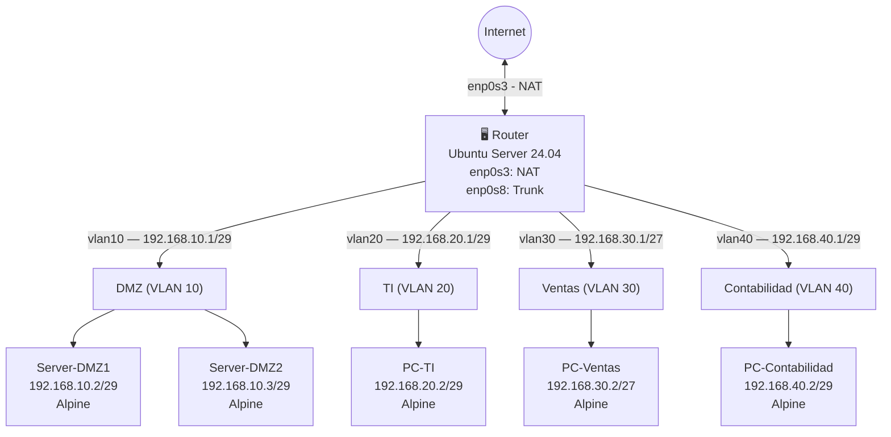

# Laboratorio 3.2: Infraestructura de Red Empresarial con VLANs
### Informe Técnico — Variante Alex

**Universidad San Francisco Xavier de Chuquisaca**  
**Asignatura:** Infraestructura, Plataformas Tecnológicas y Redes (SIS313)  
**Docente:** Ing. Marcelo Quispe Ortega  
**Semestre:** 1/2026  

**Integrantes:**
- Luis Fernando Quispe Sullca
- Calatayud Mamani Alex Josue

**Variante asignada a:** Calatayud Mamani Alex Josue

---

## 1. Resumen del escenario

Este laboratorio implementa una infraestructura de red empresarial segmentada mediante VLANs sobre un router con Ubuntu Server 24.04 y clientes Alpine Linux. La topología se basa en un esquema **Router-on-a-Stick**, donde una interfaz troncal transporta múltiples redes lógicas con etiquetado 802.1Q. El diseño permite controlar el acceso entre departamentos, aislar la DMZ, habilitar NAT selectivo hacia Internet y aplicar políticas de seguridad con UFW.

### Objetivo general

Diseñar, configurar y validar una red segmentada por VLANs, con políticas de comunicación diferenciadas por departamento y acceso controlado a Internet.

### Objetivos específicos

- Crear subinterfaces VLAN en el router.
- Configurar direccionamiento IP estático por departamento.
- Habilitar el reenvío de paquetes IPv4.
- Aplicar reglas de firewall inter-VLAN con UFW.
- Implementar NAT para las redes autorizadas.
- Verificar conectividad, aislamiento y acceso controlado mediante pruebas funcionales.

---

## 2. Topología de red



### Tabla de direccionamiento

| VM | Departamento | VLAN | Subred | IP | Máscara |
|---|---|---|---|---|---|
| Router | — | Trunk | — | Múltiples gateways | — |
| Server-DMZ1 | DMZ | 10 | 192.168.10.0/29 | 192.168.10.2 | /29 |
| Server-DMZ2 | DMZ | 10 | 192.168.10.0/29 | 192.168.10.3 | /29 |
| PC-TI | TI | 20 | 192.168.20.0/29 | 192.168.20.2 | /29 |
| PC-Ventas | Ventas | 30 | 192.168.30.0/27 | 192.168.30.2 | /27 |
| PC-Contabilidad | Contabilidad | 40 | 192.168.40.0/29 | 192.168.40.2 | /29 |

### Matriz de políticas de acceso

| Origen \ Destino | DMZ (10) | TI (20) | Ventas (30) | Contabilidad (40) | Internet |
|---|---|---|---|---|---|
| **DMZ (10)** | — | ❌ | ❌ | ❌ | ❌ |
| **TI (20)** | ✅ | — | ✅ | ✅ | ✅ |
| **Ventas (30)** | ✅ | ❌ | — | ❌ | ❌ |
| **Contabilidad (40)** | ✅ | ❌ | ✅ | — | ✅ |

---

## 3. Configuración del router (Ubuntu Server)

### 3.1 Verificación inicial de interfaces

```bash
ip a
```

**Explicación:** `ip a` (abreviación de `ip addr show`) lista las interfaces de red, sus direcciones IP, su estado y sus flags. Sirve para comprobar el punto de partida antes de realizar cualquier cambio.


---

### 3.2 Actualización del sistema e instalación de herramientas VLAN

```bash
sudo apt update
sudo apt install vlan -y
```

| Componente | Descripción |
|---|---|
| `sudo` | Ejecuta el comando con privilegios de superusuario. |
| `apt update` | Actualiza el índice local de paquetes. |
| `apt install vlan` | Instala las utilidades necesarias para trabajar con VLANs. |
| `-y` | Acepta automáticamente la instalación. |

---

### 3.3 Carga del módulo 802.1Q

```bash
sudo modprobe 8021q
```

**Explicación:** `modprobe` carga módulos del kernel en tiempo de ejecución. El módulo `8021q` habilita el etiquetado IEEE 802.1Q, necesario para crear y procesar interfaces VLAN.

> **Nota:** Para que el módulo se cargue automáticamente al iniciar el sistema, puede agregarse `8021q` a `/etc/modules`.

---

### 3.4 Configuración de Netplan para VLANs

```bash
sudo nano /etc/netplan/50-cloud-init.yaml
```

Contenido del archivo:

```yaml
network:
  version: 2
  ethernets:
    enp0s3:
      dhcp4: true
    enp0s8:
      dhcp4: no
      optional: true
  vlans:
    vlan10:
      link: enp0s8
      id: 10
      addresses:
        - 192.168.10.1/29
      nameservers:
        addresses: [8.8.8.8]
    vlan20:
      link: enp0s8
      id: 20
      addresses:
        - 192.168.20.1/29
      nameservers:
        addresses: [8.8.8.8]
    vlan30:
      link: enp0s8
      id: 30
      addresses:
        - 192.168.30.1/27
      nameservers:
        addresses: [8.8.8.8]
    vlan40:
      link: enp0s8
      id: 40
      addresses:
        - 192.168.40.1/29
      nameservers:
        addresses: [8.8.8.8]
```

**Desglose técnico:**

| Directiva | Descripción |
|---|---|
| `version: 2` | Esquema de Netplan. |
| `ethernets` | Bloque para interfaces físicas. |
| `enp0s3: dhcp4: true` | Interfaz de salida a Internet por DHCP. |
| `enp0s8: dhcp4: no` | Interfaz troncal sin IP propia. |
| `optional: true` | Evita bloqueos de arranque por disponibilidad tardía. |
| `vlans` | Bloque de subinterfaces VLAN. |
| `link: enp0s8` | Interfaz física padre. |
| `id: 10/20/30/40` | Identificador VLAN 802.1Q. |
| `addresses` | Dirección IP del gateway por VLAN. |
| `nameservers` | DNS utilizado por la subinterfaz. |

```bash
sudo netplan apply
```

`netplan apply` aplica la configuración declarativa de red sin reiniciar el sistema.


---

### 3.5 Habilitación del reenvío IPv4

```bash
sudo nano /etc/sysctl.conf
```

Línea a habilitar:

```conf
net.ipv4.ip_forward=1
```

Aplicación inmediata:

```bash
sudo sysctl -p
```

**Explicación:** `ip_forward=1` permite que el sistema operativo actúe como router y reenvíe paquetes entre interfaces. Sin este parámetro, el tráfico inter-VLAN no funcionará.

**Comandos de verificación útiles:**

```bash
cat /proc/sys/net/ipv4/ip_forward
sysctl net.ipv4.ip_forward
```

---

## 4. Configuración de firewall UFW

### 4.1 Instalación y activación

```bash
sudo apt install ufw
sudo ufw allow ssh
sudo ufw enable
```

| Comando | Propósito |
|---|---|
| `apt install ufw` | Instala Uncomplicated Firewall. |
| `ufw allow ssh` | Permite acceso SSH al router. |
| `ufw enable` | Activa el firewall. |

### 4.2 Reglas de enrutamiento inter-VLAN

#### Permisos

```bash
# TI (VLAN 20) tiene acceso total
sudo ufw route allow in on vlan20 out on vlan10
sudo ufw route allow in on vlan20 out on vlan30
sudo ufw route allow in on vlan20 out on vlan40

# Ventas (VLAN 30) solo accede a DMZ
sudo ufw route allow in on vlan30 out on vlan10

# Contabilidad (VLAN 40) accede a DMZ y Ventas
sudo ufw route allow in on vlan40 out on vlan10
sudo ufw route allow in on vlan40 out on vlan30
```

#### Denegaciones

```bash
# DMZ (VLAN 10) sin acceso saliente a otras VLANs
sudo ufw route deny in on vlan10 out on vlan20
sudo ufw route deny in on vlan10 out on vlan30
sudo ufw route deny in on vlan10 out on vlan40

# Ventas (VLAN 30) sin acceso a TI ni Contabilidad
sudo ufw route deny in on vlan30 out on vlan20
sudo ufw route deny in on vlan30 out on vlan40

# Contabilidad (VLAN 40) sin acceso a TI
sudo ufw route deny in on vlan40 out on vlan20
```

**Anatomía de `ufw route`:**

| Parte | Descripción |
|---|---|
| `ufw` | Interfaz simplificada para `iptables`. |
| `route` | Regla para tráfico reenviado. |
| `allow` / `deny` | Acción aplicada al paquete. |
| `in on vlanXX` | Interfaz de entrada. |
| `out on vlanYY` | Interfaz de salida. |

**Verificación del estado del firewall:**

```bash
sudo ufw status verbose
sudo ufw status numbered
```


---

### 4.3 NAT para acceso a Internet

```bash
sudo nano /etc/ufw/before.rules
```

Bloque a agregar al inicio del archivo:

```conf
*nat
:POSTROUTING ACCEPT [0:0]
-A POSTROUTING -s 192.168.20.0/29 -o enp0s3 -j MASQUERADE
-A POSTROUTING -s 192.168.40.0/29 -o enp0s3 -j MASQUERADE
COMMIT
```

**Desglose:**

| Elemento | Descripción |
|---|---|
| `*nat` | Declara la tabla NAT. |
| `POSTROUTING` | Cadena usada justo antes de salir del sistema. |
| `-s` | Red de origen. |
| `-o enp0s3` | Interfaz de salida hacia Internet. |
| `MASQUERADE` | Traduce la IP de origen al IP del router. |

```bash
sudo ufw reload
```

`ufw reload` recarga la configuración sin reiniciar el sistema.


---

### 4.4 Bloqueo de ICMP Forward

```bash
sudo nano /etc/ufw/before.rules
```

Cambiar:

```conf
-A ufw-before-forward -p icmp --icmp-type echo-request -j ACCEPT
```

Por:

```conf
#-A ufw-before-forward -p icmp --icmp-type echo-request -j ACCEPT
```

```bash
sudo ufw reload
```

**Explicación:** Al deshabilitar el reenvío de `echo-request`, se impide el ping entre VLANs y se refuerza el aislamiento de diagnóstico.

---

## 5. Configuración de clientes Alpine Linux

### 5.1 Instalación de soporte VLAN

```bash
apk add vlan
nano /etc/network/interfaces
```

### 5.2 PC-Contabilidad (VLAN 40)

```conf
auto lo
iface lo inet loopback

auto eth0.40
iface eth0.40 inet static
    address 192.168.40.2
    netmask 255.255.255.248
    gateway 192.168.40.1
    vlan-id 40

auto eth0
iface eth0 inet manual
    up ip link set $IFACE up
    down ip link set $IFACE down
```

```bash
service networking restart
```

### 5.3 PC-Ventas (VLAN 30)

```conf
auto lo
iface lo inet loopback

auto eth0.30
iface eth0.30 inet static
    address 192.168.30.2
    netmask 255.255.255.224
    gateway 192.168.30.1
    vlan-id 30

auto eth0
iface eth0 inet manual
    up ip link set $IFACE up
    down ip link set $IFACE down
```

```bash
service networking restart
```

### 5.4 PC-TI (VLAN 20)

```conf
auto lo
iface lo inet loopback

auto eth0.20
iface eth0.20 inet static
    address 192.168.20.2
    netmask 255.255.255.248
    gateway 192.168.20.1
    vlan-id 20

auto eth0
iface eth0 inet manual
    up ip link set $IFACE up
    down ip link set $IFACE down
```

```bash
service networking restart
```

### 5.5 Servidores DMZ (VLAN 10)

**Server-DMZ1**

```conf
auto lo
iface lo inet loopback

auto eth0.10
iface eth0.10 inet static
    address 192.168.10.2
    netmask 255.255.255.248
    gateway 192.168.10.1
    vlan-id 10

auto eth0
iface eth0 inet manual
    up ip link set $IFACE up
    down ip link set $IFACE down
```

**Server-DMZ2**

```conf
auto lo
iface lo inet loopback

auto eth0.10
iface eth0.10 inet static
    address 192.168.10.3
    netmask 255.255.255.248
    gateway 192.168.10.1
    vlan-id 10

auto eth0
iface eth0 inet manual
    up ip link set $IFACE up
    down ip link set $IFACE down
```

```bash
service networking restart
```

**Desglose de parámetros en Alpine:**

| Directiva | Descripción |
|---|---|
| `apk add vlan` | Instala soporte para VLANs. |
| `auto lo` | Levanta automáticamente loopback. |
| `iface lo inet loopback` | Define la interfaz de retorno local. |
| `auto eth0.XX` | Activa la subinterfaz VLAN. |
| `iface eth0.XX inet static` | Asigna IP fija. |
| `address` | Dirección IP del host. |
| `netmask` | Máscara de red. |
| `gateway` | Puerta de enlace. |
| `vlan-id` | Identificador de VLAN. |
| `iface eth0 inet manual` | Mantiene la interfaz física sin IP. |
| `service networking restart` | Aplica cambios en red. |

**Comandos útiles de diagnóstico:**

```bash
ip addr show
ip addr show eth0.40
ip route
service networking status
```

---

## 6. Verificación y pruebas

### 6.1 Verificación de subinterfaces en el router

```bash
ip addr show
```

Confirmar que aparecen `vlan10`, `vlan20`, `vlan30` y `vlan40` con sus direcciones correctas.


### 6.2 Pruebas de conectividad desde clientes Alpine

```bash
# Desde PC-Contabilidad
ping 192.168.40.1
ping google.com

# Desde PC-Ventas
ping 192.168.30.1
ping google.com

# Desde PC-TI
ping 192.168.20.1
ping google.com
```

**Comandos complementarios:**

```bash
traceroute 8.8.8.8
nslookup google.com
```


### 6.3 Pruebas de SSH entre VLANs

```bash
# Desde PC-Ventas
ssh 192.168.40.2

# Desde PC-Contabilidad
ssh 192.168.30.2

# Desde PC-TI
ssh 192.168.10.2
ssh 192.168.30.2
ssh 192.168.40.2
```


---

## 7. Resolución de problemas comunes

### Problema 1: La VLAN no aparece después de `netplan apply`

**Síntoma:** `ip a` no muestra `vlan10`, `vlan20`, etc.  
**Causa probable:** El módulo `8021q` no está cargado.

```bash
sudo modprobe 8021q
sudo netplan apply
```

### Problema 2: El cliente Alpine no llega al gateway

**Síntoma:** `ping 192.168.40.1` falla.  
**Diagnóstico:**

```bash
ip addr show eth0.40
service networking restart
```

### Problema 3: No hay Internet en TI o Contabilidad

**Síntoma:** `ping google.com` falla desde una red autorizada.  
**Verificación:**

```bash
cat /proc/sys/net/ipv4/ip_forward
sudo ufw status verbose
```

Si es necesario:

```bash
sudo sysctl -w net.ipv4.ip_forward=1
sudo ufw reload
```

### Problema 4: UFW no está aplicando reglas

**Síntoma:** El tráfico pasa aunque exista una regla de denegación.  
**Verificación:**

```bash
sudo ufw status numbered
sudo ufw enable
```

---

## 8. Conceptos clave aprendidos

### Jerarquía de red en este laboratorio

```text
Modelo OSI         Elemento del laboratorio
────────────────────────────────────────────
Capa 3 (Red)   →  Router Ubuntu + Netplan + UFW + iptables
Capa 2 (Enlace)→  802.1Q VLAN tagging (módulo 8021q)
Capa 1 (Física)→  Interfaces virtuales VirtualBox
```

### Principios de seguridad aplicados

1. **Menor privilegio:** Cada VLAN recibe solo el acceso necesario.
2. **Defensa en profundidad:** La DMZ está aislada por reglas, NAT selectivo y bloqueo de ping.
3. **Segmentación:** La red física se divide lógicamente en dominios controlados.

---

## 9. Conclusiones

1. La arquitectura Router-on-a-Stick demostró ser viable en entornos virtualizados:
Implementar múltiples VLANs sobre una sola interfaz troncal (enp0s8) en VirtualBox fue posible gracias al etiquetado 802.1Q, eliminando la necesidad de hardware adicional y centralizando el enrutamiento inter-VLAN en una única máquina Linux.
2. Netplan permite una gestión de red declarativa y predecible:
Definir las subinterfaces VLAN directamente en el archivo YAML de Netplan garantiza que la configuración se aplique de forma consistente en cada arranque, facilitando la revisión y el mantenimiento sin necesidad de comandos manuales adicionales.
3. El orden y la especificidad de las reglas UFW son críticos para la seguridad inter-VLAN:
Durante la práctica se comprobó que reglas globales de ICMP insertas automáticamente por UFW ignoraban las políticas de ufw route, permitiendo ping entre VLANs no autorizadas. Solo eliminando la regla icmptype 8 genérica se logró que las restricciones funcionaran correctamente.
4. El valor de DEFAULT_FORWARD_POLICY="DROP" va más allá de una buena práctica:
Sin este cambio, el kernel reenvía libremente el tráfico entre interfaces sin importar las reglas definidas. Establecer la política de FORWARD en DROP fue el punto de inflexión que hizo efectivo todo el esquema de segmentación.
5. La combinación de NAT selectivo y segmentación por VLAN replica un modelo empresarial real:
Restringir el acceso a Internet únicamente a TI y Contabilidad, mientras Ventas y la DMZ permanecen aisladas, refleja políticas de seguridad aplicadas en organizaciones reales donde no todos los segmentos requieren ni deben tener salida externa.